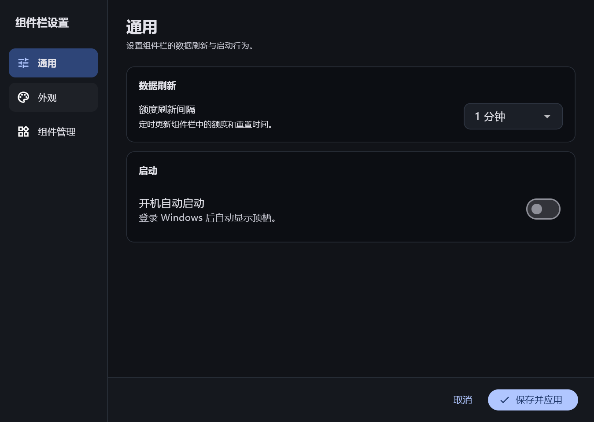
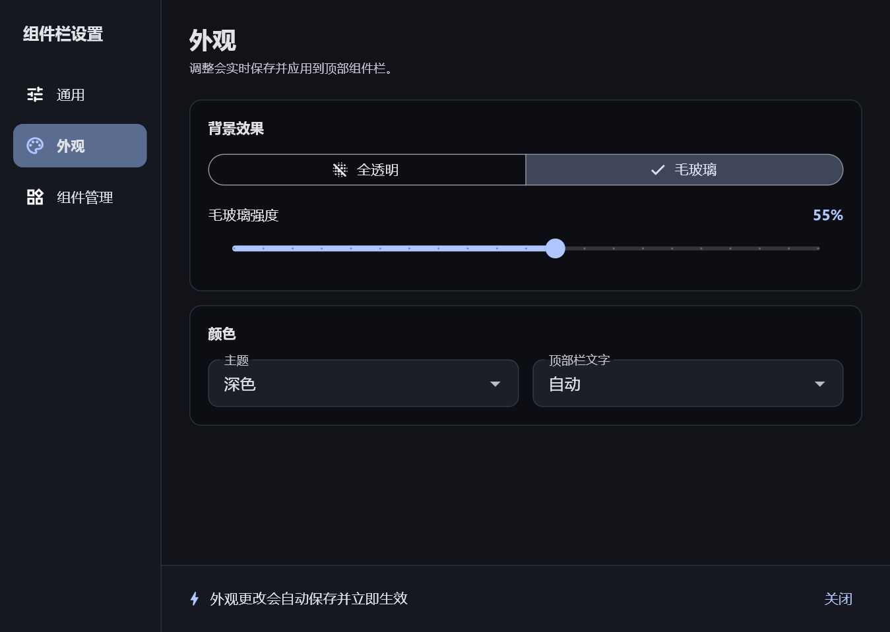
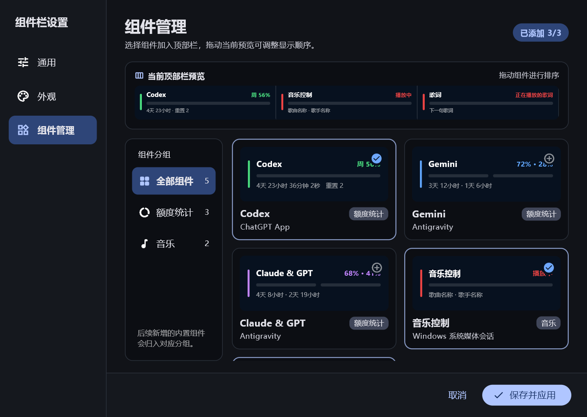

# 顶栖（TopNest）

顶栖是一款常驻 Windows 11 桌面顶部的轻量级组件容器。它将常用信息和快捷操作放在屏幕最上方，通过三个固定槽位组织不同组件，让内容随时可见，同时不遮挡正常的桌面工作区。

项目当前提供 Codex、Gemini、Claude & GPT 三个额度组件，以及音乐控制、歌词两个音乐组件。整体结构按照通用桌面组件容器设计，后续可以继续扩展时间、天气、系统状态和快捷工具等组件。

> 当前版本：`1.0.0`　·　平台：Windows 11 x64　·　技术栈：Flutter + Win32

## 界面预览

### 顶部组件栏


### 设置界面

| 通用设置 | 外观设置 |
| --- | --- |
|  |  |

### 组件管理



## 主要功能

### 桌面顶部常驻

- 主窗口以 36 像素高度固定在主显示器顶部。
- 使用 Windows AppBar 接口预留工作区，最大化窗口不会覆盖顶栖。
- 窗口无边框、保持置顶，并自动响应显示设置和工作区变化。
- 支持通过托盘图标显示、隐藏、立即刷新、打开设置或退出程序。

### 三槽组件布局

- 顶部区域固定为三个等宽槽位。
- 可以在设置中添加、移除组件，也可以拖动预览区域调整顺序。
- 移除组件后保留空槽，新组件优先加入第一个空槽。
- 组件布局会保存到本地，重新启动后仍保持上次配置。

### 额度状态展示

- 展示剩余额度、额度周期、重置倒计时和可用重置次数。
- 倒计时每秒更新，额度数据按照设置的间隔定时刷新。
- 支持 1、5、10、15、30、60 分钟刷新间隔。
- 数据刷新失败时保留上一份有效数据并标记为旧数据；没有历史数据时明确显示不可用。
- 不使用随机数或模拟内容填充缺失额度。

### 音乐播放与歌词

- 通过 Windows 系统媒体会话读取当前歌曲、歌手、专辑和封面，并提供上一首、播放/暂停、下一首控制。
- 音乐控制不绑定特定播放器，支持接入 Windows SMTC 的播放器。
- 歌词组件展示当前歌词和下一句歌词，切换时使用滚动过渡效果。
- 网易云音乐优先按歌曲 ID 获取同步歌词，其他播放器或未取得歌曲 ID 时通过 LRCLIB 匹配歌词。
- 播放状态、进度或歌词暂不可用时显示明确提示，不使用模拟内容填充。

### 个性化外观

- 支持全透明和毛玻璃两种背景效果。
- 可调节背景透明度或毛玻璃强度。
- 主题可以跟随系统，也可以固定为浅色或深色。
- 顶部文字支持自动、深色和浅色模式。
- 外观变化会实时应用并保存。

### 独立设置窗口

设置界面与顶部主窗口相互独立，包含以下页面：

- 通用：配置刷新间隔和开机自动启动。
- 外观：配置背景效果、强度、主题和文字颜色。
- 组件管理：查看组件预览，添加、移除和拖动排序。

## 内置组件

| 组件 | 数据来源 | 展示内容 | 使用条件 |
| --- | --- | --- | --- |
| Codex | 本地 Codex 会话记录及 Codex app-server | 周额度、重置倒计时、可用重置次数 | 本机存在有效的 Codex 数据；读取重置次数时需要可执行的 `codex.exe` |
| Gemini | Antigravity language server | 可用额度和重置时间 | 本机正在运行 Antigravity |
| Claude & GPT | Antigravity language server | 可用额度和重置时间 | 本机正在运行 Antigravity |
| 音乐控制 | Windows 系统媒体会话 | 歌曲、歌手、专辑、封面及播放控制 | 本机播放器支持并启用 Windows SMTC |
| 歌词 | Windows SMTC、网易云音乐及 LRCLIB | 当前歌词和下一句歌词 | 播放器提供媒体信息，并可访问对应歌词服务 |

### Codex 数据读取

顶栖优先扫描 `%USERPROFILE%\.codex\sessions` 和 `%USERPROFILE%\.codex\archived_sessions` 中最近会话文件的尾部，从本地额度事件中取得最新有效数据。这样可以减少不必要的高频接口调用。

当本地缓存不存在，或首次需要取得官方可用重置次数时，程序会查找 `codex.exe`，启动本地 app-server，并调用 `account/rateLimits/read`。账户余额不会被错误地当作重置次数。

### Antigravity 数据读取

顶栖会查找本机正在运行的 Antigravity language server，定位其本地监听端口，再从 `127.0.0.1` 接口读取 Gemini 与 Claude & GPT 的额度信息。Antigravity 的本地接口可能随版本变化，因此该读取方式按尽力兼容设计，失败时会显示明确错误状态。

本项目没有自建服务器或账号系统，数据读取逻辑集中在本地文件、本地进程和本地服务。

### 音乐与歌词数据读取

顶栖通过 Windows `GlobalSystemMediaTransportControlsSession` 获取当前系统媒体会话，并读取歌曲信息、封面、播放状态和时间轴；上一首、播放/暂停、下一首操作也通过该会话发送。歌词优先使用网易云音乐歌曲 ID 精确读取，无法精确读取时再按歌曲、歌手、专辑和时长从 LRCLIB 匹配同步歌词。

## 系统要求

### 直接运行

- Windows 11 x64。
- 如需 Codex 额度：本机具有 Codex 会话数据，建议同时安装 Codex CLI。
- 如需 Gemini、Claude & GPT 额度：本机需运行 Antigravity。
- 如需音乐控制或歌词：播放器需支持 Windows SMTC；歌词读取需要网络连接。

### 源码开发

- Flutter Stable，配套 Dart SDK 需满足 `>= 3.11.5 < 4.0.0`。
- Visual Studio 2022，并安装“使用 C++ 的桌面开发”工作负载。
- Windows 10/11 SDK。
- 制作安装程序时额外安装 Inno Setup 6。

## 快速开始

克隆项目后，在项目根目录执行：

```powershell
flutter pub get
flutter run -d windows
```

程序启动后会显示在主显示器顶部。右键单击托盘图标可以打开菜单；在顶部区域点击设置按钮可以进入独立设置窗口。

## 开发与验证

```powershell
# 静态分析
flutter analyze

# 执行测试
flutter test

# 构建 Windows Release
flutter build windows --release
```

Release 文件位于：

```text
build\windows\x64\runner\Release
```

当前测试覆盖以下关键行为：

- Codex 本地 JSONL 额度事件解析。
- Codex app-server 响应及官方重置次数解析。
- Antigravity 新旧接口数据解析和额度分组隔离。
- 多数据源并行刷新、重复刷新保护及旧数据保留。
- 三槽布局的添加、移除、交换、持久化和异常数据清理。
- 额度倒计时显示。
- Windows 媒体会话数据解析、播放控制和时间轴处理。
- 同步歌词解析、歌词源匹配、切歌加载和歌词滚动逻辑。

## 制作安装程序

先完成 Release 构建，然后使用 Inno Setup 编译安装脚本：

```powershell
flutter build windows --release
ISCC installer\topnest.iss
```

生成的安装程序位于 `dist` 目录，默认文件名为：

```text
TopNest-Setup-1.0.0.exe
```

安装程序支持开始菜单快捷方式、可选桌面快捷方式以及安装完成后直接启动。默认安装到当前用户可写的应用目录，不要求管理员权限。

## 项目结构

```text
topnest/
├─ assets/                         # 托盘图标等资源
├─ docs/
│  └─ images/                     # README 界面截图
├─ installer/
│  └─ topnest.iss                 # Inno Setup 安装脚本
├─ lib/
│  ├─ controllers/                # 数据刷新与三槽布局控制器
│  ├─ models/                     # 组件配置和额度数据模型
│  ├─ providers/                  # Codex、Antigravity 数据读取
│  ├─ services/                   # 设置持久化与 Windows 通信
│  ├─ ui/                         # 顶部窗口、设置窗口和组件界面
│  └─ main.dart                   # 程序入口、托盘和多窗口管理
├─ test/                          # 数据解析、控制器和界面测试
└─ windows/
   └─ runner/                     # AppBar、DWM 效果及原生窗口实现
```

## 技术实现

- Flutter 负责组件渲染、设置页面、状态管理和多窗口交互。
- `desktop_multi_window` 提供独立设置窗口。
- `window_manager` 管理无边框、置顶和窗口生命周期。
- `tray_manager` 提供系统托盘入口。
- `shared_preferences` 保存外观、启动设置和组件布局。
- Win32 `SHAppBarMessage` 将窗口注册到屏幕顶部并预留工作区。
- Windows DWM 与 `SetWindowCompositionAttribute` 提供浅色、深色毛玻璃及兼容回退效果。
- Dart MethodChannel 连接 Flutter 界面与原生 AppBar、DWM、系统媒体会话和工具提示能力。

### 歌词时间轴参考

歌词组件使用 Windows SMTC 提供的播放状态与时间轴，并对网易云音乐增加了歌曲实际开始播放确认，避免网络加载期间歌词提前滚动。时间轴策略参考了 [Lyricify Lite 支持说明](https://docs.lyricify.app/en/lyricify-lite/supported-apps/)及其[网易云音乐时间轴说明](https://docs.lyricify.app/lyricify-lite/app-faq/netease-cloud-music/)，SMTC 字段语义以 [Microsoft `Position` 文档](https://learn.microsoft.com/en-us/uwp/api/windows.media.control.globalsystemmediatransportcontrolssessiontimelineproperties.position?view=winrt-26100)为准。

本项目仅参考上述公开设计文档，没有复制或引入 Lyricify 的闭源代码。

## 扩展新组件

新增组件时，通常需要完成以下位置：

1. 在 `DesktopWidgetType` 中声明组件类型及展示信息。
2. 实现组件的数据模型与 Provider；纯本地组件可以不使用额度 Provider。
3. 在顶部槽位中注册对应的渲染组件。
4. 在组件管理页面加入预览卡片和组件分组。
5. 为数据解析、布局持久化和异常状态补充测试。

组件应保持独立的数据边界。某个组件读取失败不应阻塞其他组件，也不应使用另一组件的数据填补缺失内容。

## 当前限制

- 当前只支持 Windows，原生窗口实现针对 Windows 11 设计。
- 顶部窗口固定在主显示器，暂不支持选择其他显示器。
- 当前固定为三个槽位，尚未提供自定义槽位数量。
- 音乐控制依赖播放器对 Windows SMTC 的支持，播放器未提供的媒体信息或控制能力无法补全。
- 歌词依赖网易云音乐或 LRCLIB 的在线数据，部分歌曲可能没有匹配的同步歌词。
- 天气和系统状态等组件仍待扩展。
- Antigravity 使用本地非公开接口，兼容性可能受其版本升级影响。

## 名称含义

“顶”表示常驻屏幕顶部，“栖”表示不同组件可以在这里安放与排列。TopNest 不绑定某个数据来源或组件类型，额度统计只是起点。
